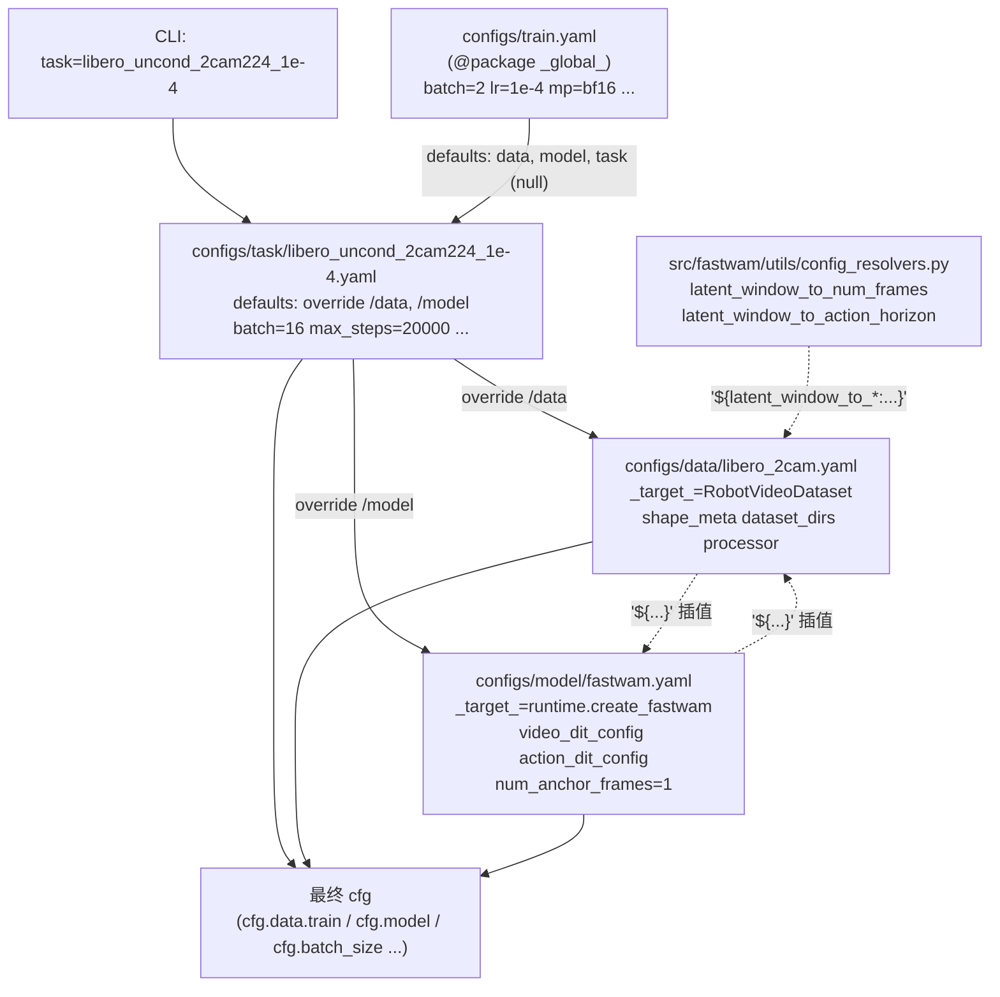
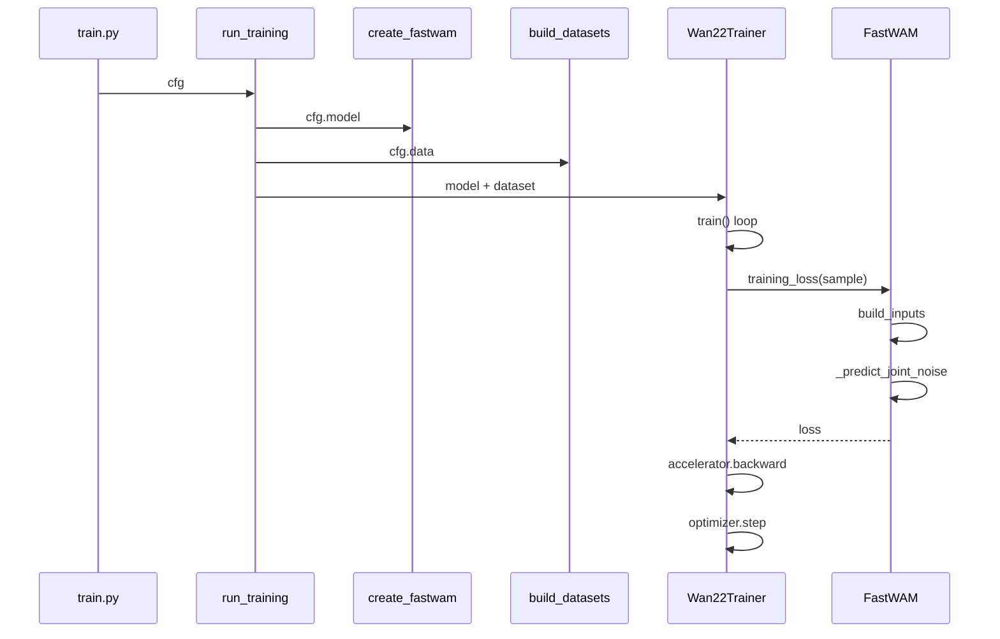

# FastWAM 代码阅读路线

## 0. 阅读心法（贯穿全 8 层的"北极星"）

### 0.1 粒度随层数递进，不要全程一档

- **L1-L4：架构优先**——目标是调用链 + 形状流；细节卡壳就跳过。
- **L5：细节优先但有选择**——只深读"会撬动模型表达力/复杂度"的点（5 个创新点锚），其余照旧跳。
- **L6：中详细**——画清滑窗时间轴 + 多相机拼接两张图即可。
- **L7：diff 阅读**——不读代码找 diff，跟着 `action_v2.4.md` 文档去代码里"打卡"。

### 0.2 五条硬规矩

1. **10 分钟不懂就跳**：在 `mawam_dev/reading_notes.md` 写下"此处待深入"，继续前进。绝不在前期钻洞。
2. **先签名后函数体**：每进入一个新文件，先 grep 出 `def/class` 列表当成"目录"读完，再决定哪个进函数体。
3. **跑一遍胜过读十遍**：任何"shape 不确定 / 控制流绕"的地方，写 5 行代码起一个 `batch_size=1` 的 forward，print 一遍 tensor shape——比读代码有效 10 倍。
4. **diff 式阅读变体**：`fastwam_joint` / `fastwam_idm` 这类衍生类**只读重写的几行**，不要从头通读。
5. **带着问题读**：每层都给出"读完应能答"清单，答不上就回到对应函数；答得上就立刻进下一层。

### 0.3 两条主干 + 五个创新点锚（全程心智地图）

```mermaid
flowchart TB
  subgraph trunks [两条主干]
    T1["训练: train.py → run_training → Wan22Trainer → fastwam.training_loss"]
    T2["推理: run_*_manager.py → fastwam.infer_action → mot KV-cache"]
  end

  subgraph anchors [五个创新点锚 (L5)]
    A1["adaLN modulation (DiTBlock)"]
    A2["attention mask (FastWAM + WanVideoDiT)"]
    A3["MoT 混合 attention (mot._mixed_attention)"]
    A4["KV-cache 复用充分条件 (mot.prefill)"]
    A5["anchor 每步 clean 注入 (_predict_joint_noise)"]
  end

  T1 -.->|经过| A1
  T1 -.->|经过| A2
  T1 -.->|经过| A3
  T1 -.->|经过| A5
  T2 -.->|经过| A4
```

把这张图保存在脑子里——读任何代码都先问"这是哪条主干上的、是不是创新点锚"。是锚就深读，不是就扫读。

### 0.4 一图流 + 一答清单（每层强制产出）

每完成一层，逼自己产出两件东西，否则不算"通关"：
- **一张图**：调用链 / 时序图 / 形状流 / mask 形状（mermaid 或纸笔均可）。
- **一份答**：把"读完应能答"那几道题口述出来，不看代码。

这两个产出会在 L8 创新阶段反复被你自己引用——**它们才是阅读的真正成果，不是"我读完了哪些文件"**。

---

## 1. 第一层：项目全景（~1 小时，纯读文档）

目标：把术语、目录、数据形状在脑子里过一遍，不求懂细节。

- [README.md](README.md) §File Structure / Training / Inference：先看命令，再看代码。
- [AGENTS.md](AGENTS.md) §项目概述 / 架构说明 / 关键设计决策：这是本仓库最浓缩的地图。
- [mawam_dev/plans_and_actions/multi_anchor/multi_annchor_report.md](mawam_dev/plans_and_actions/multi_anchor/multi_annchor_report.md) §1-2：先只看原始 Fast-WAM 回顾与 multi-anchor 语义，别陷入符号。

**读完应能答**：
- Fast-WAM 论文核心主张是什么？为什么说"test-time 不生成未来视频"？
- 视频/动作两路 token 谁是专家（MoT），在哪融合（attention）？
- 模型三兄弟 `FastWAM` / `FastWAMJoint` / `FastWAMIDM` 的差别是什么？

---

## 2. 第二层：配置系统（以 LIBERO fastwam 训练为例）

Hydra + OmegaConf 是贯穿训练/推理的"仪表盘"。**配置没看懂之前，读任何代码都会迷路**——因为代码里到处是 `cfg.xxx`，不知道这个键从哪来、被谁覆盖。

### 2.1 四份配置文件的"从属"关系（一图看懂）

命令：`bash scripts/train_zero1.sh 8 task=libero_uncond_2cam224_1e-4`



**两个隐藏信息点**（初读最容易漏）：
1. `configs/train.yaml` 里 `defaults: [_self_, data: null, model: null, task: null]` — **data/model 默认是空**，必须由 task 通过 `override /data: libero_2cam` 指定。
2. `configs/task/*.yaml` 第一行 `# @package _global_` — 意思是该文件里的键**直接挂到 cfg 根下**（覆盖 train.yaml 同名字段，如 `batch_size: 16`），而不是挂到 `cfg.task.*`。

### 2.2 Hydra 组装顺序（调试的必备心智模型）

当你跑 `task=libero_uncond_2cam224_1e-4`，Hydra 严格按下面顺序合并：

1. **骨架**：`configs/train.yaml` 被加载，但 defaults 里 `data/model/task` 还是 null。
2. **task 接管 defaults**：读 `configs/task/libero_uncond_2cam224_1e-4.yaml` 的 `defaults` 块，发现 `override /data: libero_2cam` 和 `override /model: fastwam`，于是把 `configs/data/libero_2cam.yaml` 挂到 `cfg.data`，`configs/model/fastwam.yaml` 挂到 `cfg.model`。
3. **_self_**：task.yaml 里 `_self_` 在 defaults 之后，所以 task 里写的 `batch_size: 16`、`model.mot_checkpoint_mixed_attn: false` **在最后生效**，覆盖前面的默认值。
4. **OmegaConf 插值**：所有 `${xxx.yyy}` 和 `${resolver:args}` 延迟到访问时才求值——即在 `runtime.run_training(cfg)` 读 `cfg.data.train.num_frames` 的一刻，才会跑 `latent_window_to_num_frames(1, 2, 4, 4) = 33`。

**一条核心规则**：后加载的同名 key 覆盖先加载的。所以"谁能覆盖谁"就是看 Hydra 加载顺序——**task.yaml 是最后的赢家**（在 `_self_` 位置），这就是为什么所有任务级覆盖都放在 task 文件里。

### 2.3 跨文件插值的三种形态（这是最绕的部分）

[configs/model/fastwam.yaml](configs/model/fastwam.yaml) 和 [configs/data/libero_2cam.yaml](configs/data/libero_2cam.yaml) 之间**互相引用**，初读会转晕。记住三种形态：

| 形态 | 例子 | 含义 |
|---|---|---|
| 值引用 | `proprio_dim: ${data.train.processor.proprio_output_dim}` (model) | 运行时把 data 侧的值"借"过来 |
| 反向引用 | `num_anchor_frames: ${model.num_anchor_frames}` (data) | data 侧反过来从 model 取 N |
| 自定义解析器 | `num_frames: ${latent_window_to_num_frames:${...},${...},4,4}` | 调 resolver 函数算出来 |

**实战提示**：遇到 `${...}` 别去猜，在 terminal 跑一行：

```bash
python -c "from hydra import initialize, compose; from fastwam.utils.config_resolvers import register_default_resolvers; register_default_resolvers()
from hydra import initialize_config_dir; import os
from hydra.core.global_hydra import GlobalHydra; GlobalHydra.instance().clear()
initialize_config_dir(config_dir=os.path.abspath('configs'), version_base=None)
cfg = compose(config_name='train', overrides=['task=libero_uncond_2cam224_1e-4'])
from omegaconf import OmegaConf; print(OmegaConf.to_yaml(cfg, resolve=True))" | less
```

这一行能打印**完全 resolve 后的最终 cfg**，所有插值求值好、所有覆盖生效——比读 YAML 原文有效 10 倍。

### 2.4 推荐阅读顺序（25 分钟走完）

按"**从外到内**"读，不要从 model.yaml 开始（最绕）：

1. **3 min** — [configs/train.yaml](configs/train.yaml)：认识 `defaults` + 根字段（batch、lr、wandb 等）。
2. **5 min** — [configs/task/libero_uncond_2cam224_1e-4.yaml](configs/task/libero_uncond_2cam224_1e-4.yaml)：看 `override /data`、`override /model`、`_self_` 的位置，理解"task 是组合器+最后覆盖者"。
3. **8 min** — [configs/data/libero_2cam.yaml](configs/data/libero_2cam.yaml)：重点看 `_target_=RobotVideoDataset`、`shape_meta`、`num_frames`/`action_horizon` 的插值公式；**忽略 processor 的细节**（留给 L6）。
4. **5 min** — [configs/model/fastwam.yaml](configs/model/fastwam.yaml)：只看 `_target_`、`video_dit_config` 和 `action_dit_config` 的 hidden_dim/layers 等"形状"字段；**忽略 scheduler/loss 权重**（留给 L3）。
5. **4 min** — [src/fastwam/utils/config_resolvers.py](src/fastwam/utils/config_resolvers.py)：只看 `latent_window_to_num_frames` / `latent_window_to_action_horizon` 两个函数；其他 resolver 扫一眼即可。

### 2.5 N=1, M=2 默认配置的推导自检

读完后，请在不查代码的情况下填出下表（答案在 [AGENTS.md](AGENTS.md) §多锚点帧）：

- `K_vf = 4`, `D_vae = 4`
- `N = model.num_anchor_frames = 1`
- `M = data.train.num_denoise_latent_frames = 2`
- `num_frames = 1 + 4·4·(1+2−1) = ?`
- `action_horizon = 4·4·2 = ?`
- `num_latent_frames = N + M = ?`

填不出来就回到 `config_resolvers.py` 再看一眼。

### 2.6 读完应能答

- 改动 `task=*` 的哪个字段会触发 DataLoader 重建？哪些只影响 optimizer？
- 为什么 `data.train.num_anchor_frames: ${model.num_anchor_frames}` 这个**反向引用**是合理的？（提示：唯一真源原则）
- 如果我想把 `batch_size` 从 16 改成 32，应该改 task.yaml 还是 train.yaml？为什么？

---

## 3. 第三层：训练纵切（架构优先，不逐行读）

**核心原则**：这一层是"搭骨架"，**不是**"读细节"。目标是能画出调用链 + 形状流，而不是理解每个 if-else。

### 3.1 读前定调（1 min）

给自己立三条规矩：
- **卡 10 分钟就跳过**：任何一处卡 10 min 仍不懂，写进 `mawam_dev/reading_notes.md`，继续前进，等 L5 再回。
- **先签名后函数体**：每个新文件进入前，先用 grep 把 `def/class` 列表打出来当作"目录"。
- **只走主干**：`if DEBUG` / 异常处理 / 日志 / wandb / DeepSpeed 细节——**一律跳过**。

### 3.2 步骤 A：只看签名画"目录图"（30 min）

**不进函数体**，只把下面四个文件的 `def/class` 列表看一遍，画出"谁调用谁"：

- [scripts/train.py](scripts/train.py)：看 `@hydra.main` + main 体怎么把 cfg 交给 `run_training`。
- [src/fastwam/runtime.py](src/fastwam/runtime.py) L428 `run_training`、L91 `create_fastwam`、L386 `build_datasets`。
- [src/fastwam/trainer.py](src/fastwam/trainer.py) L43 `__init__`、L675 `train`、L394 `evaluate`。
- [src/fastwam/models/wan22/fastwam.py](src/fastwam/models/wan22/fastwam.py) L553 `training_loss`、L358 `build_inputs`、L706 `_predict_joint_noise`。

**产出**：一张箭头图（纸上或 mermaid），形如：



画完这张图就算"步骤 A 过关"——不需要懂任何函数体内部。

### 3.3 步骤 B：三条黄金路径（每条 30-45 min）

只钻下面三个函数的**主干**，复杂分支全跳过：

**路径 ①：数据入模型 — `FastWAM.build_inputs`（fastwam.py L358）**

只关心：
- 入参 `sample` 有哪些 key？（`pixel_values`、`action`、`state`、`context`、`context_mask` 等）
- 出参字典里，video latent 和 action 张量的 **shape 和 dtype** 分别是什么？
- anchor 帧是在 `build_inputs` 里切出来的还是别处？

**读法**：开一个 notebook，`cfg = compose(...)`，随便从 dataset 取一条样本，直接调 `build_inputs`，打印每个输出 tensor 的 shape——比读代码快 10 倍。

**路径 ②：loss 怎么算 — `training_loss` + `_predict_joint_noise`（fastwam.py L553 / L706）**

只关心 flow-matching 的"三件套"：
- 给干净 latent 加什么噪声？（`x_t = (1-t)·x_0 + t·noise`）
- 模型预测什么？（速度场 `v = noise - x_0`）
- 目标是什么？（`v_target = noise - x_0`，算 MSE）
- anchor latent 在加噪时是如何被"保持 clean"的？（找到那个 mask 或 slice 赋值）

**读不懂时**：对照 HuggingFace `diffusers` 里 flow-matching pipeline 的 5 行核心伪代码，结构是一样的。

**路径 ③：训练循环 — `Wan22Trainer.train`（trainer.py L675）**

只关心时序：
- for epoch → for batch 的主干。
- `accelerator.accumulate` 上下文管理器如何协调梯度累积。
- 什么时候调用 `evaluate()`、什么时候 `save_checkpoint()`。

**跳过**：wandb 日志、ETA 估算、各种 fallback 分支。

### 3.4 步骤 C：主动调试（1 小时，效果最强）

读 10 遍代码不如跑 1 次。把 `batch_size=1`、`num_epochs=1`、`max_steps=2` 设好，在下面三处下断点：

1. `trainer.train()` 的 for loop 第一次进入 `training_loss` 前——看 `sample` 是什么。
2. `fastwam._predict_joint_noise` 入口——看 latent 加噪前后的 shape 和数值范围。
3. `trainer.py` `accelerator.backward(loss)` 前——看 loss 的值和 grad_fn。

跑通这一次，前面所有的疑问都会当场消解一大半。

### 3.5 步骤 D：自测（10 min）

合上代码，答这 4 题（答不出就回步骤 B 对应路径）：
- 一个 batch 从 dataloader 出来到 `loss.backward()` 的调用链（最少 6 步）。
- video_loss 和 action_loss 各自在哪条 tensor 上算？目标是什么？
- anchor 帧在训练时每个扩散步是 noisy 还是 clean？代码里哪一行保证了这一点？
- 解冻参数是哪些？（能说出 2 个具体模块名，如 `model.dit.*` 和 `proprio_encoder`）

### 3.6 读完应达到的能力（L3 通关判据）

1. 能 5 分钟向别人口述训练主干调用链，不看代码。
2. 给"加一个新 auxiliary loss"这类需求，能**立刻指出**应改 `fastwam.training_loss` 和 `trainer.train` 的哪一行附近，即使还不会写具体代码。

---

## 4. 第四层：推理纵切（比训练简单，1-1.5 小时）

**核心观察**：推理只比训练少一件事（不算 loss）、多一件事（KV-cache 复用）。读法和 L3 一致：**架构优先**。

### 4.1 步骤 A：只读两个函数的签名 + 对比 `infer_joint` vs `infer_action`（20 min）

- [fastwam.py L865 `infer_joint`](src/fastwam/models/wan22/fastwam.py) — 同时去噪 video+action。
- [fastwam.py L1056 `infer_action`](src/fastwam/models/wan22/fastwam.py) — 论文核心卖点，video 只做一次 prefill。

**推荐读法**：左右分屏打开两个函数，**diff 式**阅读——两者前半段（encode、build context）几乎一样，差异集中在去噪循环。看差异就懂了设计。

### 4.2 步骤 B：KV-cache 两个函数（30 min）

- [mot.py L263 `prefill_video_cache`](src/fastwam/models/wan22/mot.py)：只关心"存了什么 tensor、哪几层、shape 是什么"。
- [mot.py L349 `forward_action_with_video_cache`](src/fastwam/models/wan22/mot.py)：只关心"cache 里的 K/V 怎么被 action 的 Q 用"。

**一个关键问题**：为什么 video token 在多步去噪 action 时**不需要重算**？
答：因为 anchor 帧 latent 在每步都 clean，video 的 Q/K/V 和 hidden state **不随 action 的噪声步变化**，于是一次 prefill 可永久复用。搞清这一点就抓住了 Fast-WAM 的精髓。

### 4.3 步骤 C：policy 包装（15 min，按需）

- [experiments/libero/run_libero_manager.py](experiments/libero/run_libero_manager.py) + `experiments/libero/fastwam_policy/`：这是仿真评测侧的胶水代码，主要做"环境观察 → 归一化 → `model.infer_action` → 反归一化 → 执行"。
- **只需大致扫一眼**，不用深读——它不是研究创新点。

### 4.4 调试建议（可选但强烈推荐）

用 released checkpoint 跑一次 `experiments/libero/run_libero_manager.py` 的单 episode（`MULTIRUN.num_gpus=1`），在 `infer_action` 入口和 `prefill_video_cache` 出口各打一个 `print(x.shape)`，两分钟就能建立形状直觉。

### 4.5 读完应能答

- 一次完整 `infer_action` 调用里，video 专家被 forward 几次？action 专家被 forward 几次？
- 如果把 diffusion 步数从 10 减到 4，调用次数怎么变？
- `num_anchor_frames=2` 时，prefill 存的 K/V tensor 沿 **时间维** 长度是多少？（用 L2 的公式推）
- `infer_joint` 相比 `infer_action`，在"是否重算 video"这一点上做了什么取舍？为什么论文说"不需要"？

---

## 5. 第五层：模型核心横切（细节优先，2-4 小时）

### 5.0 读法定调（与 L3/L4 不同）

L3/L4 是"搭骨架"，可以跳过细节；**L5 是"钻井"层，该懂细节就要懂**——但仍然**有选择性**。

- **必须深读**的：每个 block 的 forward、attention mask 构造、modulation (adaLN) 注入、RoPE、MoT 混合 attention 与 KV-cache、anchor 注入逻辑。
- **可以扫读**的：`pre_dit`/`post_dit` 的预处理细节、各种 `_validate_*`、gradient-checkpoint 包装。
- **直接跳过**的：兼容性分支（旧 ckpt 路径）、日志、assert。

判断标准：**"这一段代码如果我要改，会影响模型表达能力/计算复杂度吗？"**——会则深读，不会则跳过。

### 5.1 推荐阅读顺序（由简到繁，先建 mental model）

| # | 文件 | 重点函数 | 阅读目标 |
|---|---|---|---|
| 1 | [action_dit.py](src/fastwam/models/wan22/action_dit.py) | `ActionDiT.forward` L304 / `pre_dit` L226 / `ActionHead` L18 | 跑通"最小 DiT 块"的 mental model |
| 2 | [wan_video_dit.py](src/fastwam/models/wan22/wan_video_dit.py) | `DiTBlock.forward` L249 / `create_group_causal_attn_mask` L64 / `rope_apply` L55 | 搞懂 RoPE + adaLN-modulation + attention mask |
| 3 | [mot.py](src/fastwam/models/wan22/mot.py) | `MoT.forward` L454 / `_mixed_attention` L77 / `_build_expert_attention_io` L124 | 抓住"拼接一次 attention、分开 post-block"的精髓 |
| 4 | [mot.py](src/fastwam/models/wan22/mot.py) | `prefill_video_cache` L263 / `forward_action_with_video_cache` L349 | KV-cache 的数据结构与复用边界 |
| 5 | [fastwam.py](src/fastwam/models/wan22/fastwam.py) | `_build_mot_attention_mask` L491 / `_predict_joint_noise` L706 / `training_loss` L553 | anchor 注入 + flow matching 双调度的顶层拼装 |
| 6 | [fastwam_joint.py](src/fastwam/models/wan22/fastwam_joint.py) + [fastwam_idm.py](src/fastwam/models/wan22/fastwam_idm.py) | 只做 diff 式略读 | 理解三个变体的**唯一差异**在哪 |

**辅料**（1387 行的 `wan_video_vae.py` 和 342 行的 `wan_video_text_encoder.py`）：只看顶层类的 `encode/decode/forward` 签名和出入 shape，**内部网络结构完全跳过**——它们不是你的创新面。

### 5.2 必须盯住的 5 个"创新点锚"

这是 L5 真正的价值——读完后你知道**改哪一行会撬动什么**：

**锚 ①：adaLN modulation（DiTBlock.forward）**
`wan_video_dit.py` L249 `DiTBlock.forward` 里 `modulate(x, shift, scale)` + `x + gate * attn_out`。DiT 的"每个 block 都被 timestep 条件化"是通过这里实现的。
- **创新切入**：条件信号可以多塞一维（比如 task embedding、accelerometer 残差）。

**锚 ②：attention mask（_build_mot_attention_mask / create_group_causal_attn_mask）**
`fastwam.py` L491 + `wan_video_dit.py` L64。理解 `[video_token_block || action_token_block]` 拼起来后的 2D mask 长什么样——哪些位置被 mask 掉、mask 模式如何随 `num_anchor_frames` 变化。
- **创新切入**：mask 模式（first_frame_causal / group_diagonal）决定了信息流动；换成稀疏/跨帧的 mask 是天然的实验点。
- **建议**：在草稿纸上画出 N=2, M=2 时的 mask 形状（行列标出 video latent 0/1 anchor, 2/3 denoise, action chunks），比读代码有效。

**锚 ③：MoT 混合 attention（_mixed_attention + _build_expert_attention_io）**
`mot.py` L77 + L124。每个 expert 独立投影 Q/K/V → 拼接 → 一次 flash-attention → 拆回。**这是 Fast-WAM 相比"各跑各的双流 Transformer"的唯一架构创新点**。
- **创新切入**：能否换成 mixture-of-experts 路由？能否在拼接维做稀疏？
- **盯住的具体细节**：拼接后 K/V 的 shape、num_heads 是否要求两 expert 一致（要求一致）、投影矩阵是否共享（不共享，这是 MoT 的定义）。

**锚 ④：KV-cache 复用的充分条件（prefill_video_cache / forward_action_with_video_cache）**
`mot.py` L263 + L349。**为什么 video K/V 可以一次 prefill 永久复用？**——因为 video 的 Q/K/V 只依赖 clean anchor latent 和视频 diffusion step（推理时为单点），不依赖 action 的 diffusion step。
- **创新切入**：任何破坏这个独立性的修改（比如 action→video 回传、video 也变 noisy）都会让 cache 失效，这是速度与能力的 tradeoff 线。

**锚 ⑤：anchor 注入的"每步 clean"机制（_predict_joint_noise + training_loss）**
`fastwam.py` L553 + L706。训练时 noisy latent 被计算出来后，**前 N 帧位置被 clean latent 覆盖**（或者 noise schedule 被置零），保证输入 DiT 的 anchor 永远干净。具体定位需要你在函数体里找那个 slice 赋值——这是 v2.4 多锚点的落地点之一，可顺带对照 `action_v2.4.md`。
- **创新切入**：这个"硬切换"可以改成 soft（比如 clean/noisy 的线性 blend）、learnable gate、甚至部分 mask 掉一些 anchor 帧来做 dropout 条件。

### 5.3 调试建议（1 次 forward 胜过读 10 次）

在 `MoT._mixed_attention` 入口打断点，跑一个 `batch_size=1` 的 `training_loss`，打印：
- video_q, video_k, video_v 的 shape
- action_q, action_k, action_v 的 shape
- 拼接后进 flash-attention 的 shape
- mask 的 shape 和稀疏模式（`mask.float().mean()` 看占比）

这 5 个 tensor shape 刻在脑子里，L5 就算过关。

### 5.4 三变体的 diff 式阅读（20 min，别花更多）

| 文件 | 与 FastWAM 的**唯一差异** |
|---|---|
| [fastwam_joint.py](src/fastwam/models/wan22/fastwam_joint.py) L29 `_build_mot_attention_mask` | action 可以看**全部** video token（不是只看 anchor） |
| [fastwam_idm.py](src/fastwam/models/wan22/fastwam_idm.py) L20 `_build_teacher_forcing_attention_mask` + L61 `training_loss` | 两阶段 + teacher forcing，训练时有"干净未来"信号 |

读法：打开 fastwam.py 原函数 + 变体函数左右对比，**只看重写的那几行**。

### 5.5 读完应能答

- 画出 MoT 一个 block 的计算图（11 个算子级节点就够）。
- 说出 N=2 时 video token 序列长度是多少、action token 序列长度是多少、mask 的稀疏度大约多少。
- 描述 `_predict_joint_noise` 如何区分"需要监督 loss 的位置"和"只用于条件的 anchor 位置"。
- 从三变体的 `_build_mot_attention_mask` 差异说出"Fast-WAM 的核心假设是什么"。

---

## 6. 第六层：数据流水线（中详细，1-1.5 小时）

### 6.0 读法定调

数据侧**不需要像 L5 那么细**——你不会在这里做研究创新，但它决定了喂给模型的 tensor 长什么样，任何模型改动都要先确认数据侧能"配合"。

**目标**：能独立解释"一个 LeRobot episode 如何变成 `(pixel_values, action, state, context)` 四元组"。

### 6.1 三段式拆解

数据管线其实只有三段：**采样窗 → Processor 变换 → Collate 成 batch**。按这个顺序读：

**段 ①：采样窗（15 min）**
[robot_video_dataset.py](src/fastwam/datasets/lerobot/robot_video_dataset.py) — 只读三个函数：
- L26 `__init__`：重点在 L50-72 的"N/M 合法性 assert"（`AGENTS.md` multi-anchor 节有对应说明），这是新手最容易卡的地方。
- L193 `_get`：滑窗如何从 episode 切出 `num_frames` 帧观察 + `action_horizon` 动作。
- L365 `__getitem__`：调用 `_get` + processor + `_get_cached_text_context`。

**跳过**：各种边界处理 (`skip_padding_as_possible`)、episode 长度统计日志。

**段 ②：Processor 变换（20 min）**
[fastwam_processor.py](src/fastwam/datasets/lerobot/processors/fastwam_processor.py) — 只读一个函数：
- L184 `preprocess`：顺序是 `action_state_transform` → 多相机拼接 → 图像 train_transforms → 归一化。
- L151 `action_state_transform`：delta action + state padding，对应 config 里 `delta_action_dim_mask` / `action_state_merger`。

**跳过**：`postprocess`（只在推理时用，L4 已接触）、`augment_instruction`（文本扰动）。

**transforms/ 子目录**：全部**略读**——`image.ToTensor` 就是 ToTensor，`action_state_merger.ConcatLeftAlign` 看名字就懂。

**段 ③：预处理脚本（10 min，但只是确认心智模型）**
- [scripts/precompute_text_embeds.py](scripts/precompute_text_embeds.py)：理解"为什么 dataset 里是 `.pt` 缓存而不是实时 T5"。
- [scripts/preprocess_action_dit_backbone.py](scripts/preprocess_action_dit_backbone.py)：理解"ActionDiT 怎么从 Wan VideoDiT 插值初始化的"——这是 `AGENTS.md` 里提到的"alpha-scaling linear interpolation"的实际代码。

### 6.2 两个必须画清的图

**图 ①：滑窗时间轴**（以 LIBERO N=1, M=2 为例）

```
raw step:   0   1   2   ...  31  32
visual:     [----- num_frames=33 -----]
            ^                        ^
          anchor                 (last obs)
action:     [----- action_horizon=32 -----]
            ^
           "current" step 动作
```

N 改成 2 时，visual 变 49、anchor 变 2 帧、action 起始点右移。把这张图画在草稿纸上——所有 multi-anchor 的理解都基于它。

**图 ②：多相机拼接 pipeline**

```
LIBERO: image (224,224) + wrist_image (224,224)
         → concat_multi_camera="horizontal"
         → (224, 448)         ← data.yaml 里的 video_size
         → VAE encode
         → latent (T, C=48, H', W')
```

**RoboTwin** 用 3 相机网格拼接，`video_size: [384, ...]`——换任务时第一个要改的就是这个。

### 6.3 调试建议

写 5 行代码直接构造一个 dataset 实例取第一条：

```python
from hydra import compose, initialize_config_dir
from hydra.utils import instantiate
# ... 拿到 cfg
ds = instantiate(cfg.data.train)
s = ds[0]
for k, v in s.items():
    print(k, v.shape if hasattr(v, 'shape') else type(v))
```

一条 sample 的 key 和 shape 看到了，段 ①② 的所有疑问都消解了。

### 6.4 读完应能答

- 多相机拼接发生在 dataset `_get` 里还是 processor `preprocess` 里？拼完的 tensor shape 是多少？
- `delta_action_dim_mask: [true, true, true, true, true, true, false]` 具体作用于 action 的哪一维、做了什么？
- 如果想接一个**新数据集**（新相机数、新 action 维度），需要改哪 3 处配置/代码？

---

## 7. 第七层：multi-anchor 专题（diff 阅读，1 小时）

### 7.0 读法定调

L7 和前面完全不同——**不读代码文件，读 diff 文档**。`mawam_dev/plans_and_actions/multi_anchor/` 里的三份文档**已经精确标注了**代码改了哪些文件、哪些行、为什么改。你要做的是用这三份文档当"导览"去对照实际代码。

**建议**：开两个编辑器窗口——左边 `action_v2.4.md`，右边跟着文档跳到对应代码行。**绝对不要直接读代码找 diff**。

### 7.1 三份文档的正确读序

| # | 文档 | 目的 | 读法 |
|---|---|---|---|
| 1 | [multi_annchor_report.md](mawam_dev/plans_and_actions/multi_anchor/multi_annchor_report.md) | 机制 WHAT | 纯读，建立"多锚点做了什么"的心智模型 |
| 2 | [plan_opus4.7_v2.4.md](mawam_dev/plans_and_actions/multi_anchor/plan_opus4.7_v2.4.md) | 设计 WHY | 纯读，理解为什么这样设计（比如为什么 `action_horizon` 只依赖 M） |
| 3 | [action_v2.4.md](mawam_dev/plans_and_actions/multi_anchor/action_v2.4.md) | 落地 HOW | 左文档右代码对照，**这是主菜** |

### 7.2 对照读代码的"锁定点"清单

跟着 `action_v2.4.md` 在代码里找到下面这些点——找到即算懂：

- **配置侧**：`config_resolvers.py` 的 `latent_window_to_*` 两个函数 + `configs/data/libero_2cam.yaml` 的 `num_frames/action_horizon` 插值表达式。
- **数据侧**：`robot_video_dataset.py` L50-72 的那一组 assert（N/M/K_vf/D_vae 合法性）。
- **模型侧**：`fastwam.py` 里 `num_anchor_frames` 被用到的地方（anchor 切片 + attention mask 计算 + loss mask）。
- **ckpt 侧**：`fastwam.py` 的 `save_checkpoint` / `load_checkpoint` 里对 `num_anchor_frames` 的处理（v2.4.1 的 WARNING 逻辑）。
- **评测侧**：`action_horizon` 与 `EVALUATION.action_horizon` 不一致时的 WARNING（v2.4.1 新增）。

### 7.3 读完应能答（L7 通关判据）

- 为什么 `action_horizon = 16·M`、与 N 无关？（从语义、代码、数据三个角度讲清）
- ckpt 跨 N 载入为什么只给 WARNING 而不是 error？这暴露了什么兼容边界？
- 如果让你做"变长 anchor"（每个 batch 的 N 不同），现在代码里最先撞墙的是哪一处 assert？
- 多锚点落地过程中最 tricky 的工程决策是什么？（提示：唯一真源问题——参数在 model 还是 data 侧定义）

### 7.4 L7 的战略价值

multi-anchor 是本仓库**唯一一次完整的"设计→实现→文档"改动链路**。读懂它 = 同时学到：
1. 该团队在代码库做创新的**标准流程**（plan → action → report）；
2. 一个改动需要触及哪些模块（配置+数据+模型+ckpt+eval，**全栈**）；
3. 未来你自己提创新时，可以照这个模板走。

**L7 读完，就具备了在该仓库独立做研究创新的工程能力。**

---

## 8. 第八层：面向创新的"钩子清单"（收官）

读完前 7 层，回头问自己"哪些地方最容易插新点子"。典型切入点（仅供讨论，不是结论）：

- **条件面**：多锚点已经做了，下一步可能是"非均匀采样锚点 / learned anchor weighting / 过去动作回灌"。
- **注意力面**：MoT 的 `[video||action]` 拼接 attention 是否可以换稀疏/路由结构？KV-cache 粒度能否再压？
- **调度面**：视频 vs 动作独立 flow-matching 调度——能否联合自适应？
- **数据面**：多相机拼接 vs 多视角 token 化，是否值得一试？
- **推理面**：`infer_action` 扩散步数能否蒸馏到 1-2 步（consistency / MeanFlow 类）？

---

## 各层阅读粒度总览

| 层 | 主题 | 粒度 | 重点 | 时间 |
|---|---|---|---|---|
| L1 | 全景 | 只读文档 | 术语、目录、命令 | 1h |
| L2 | 配置 | 选读 | Hydra 组装顺序、插值、resolver | 0.5h |
| L3 | 训练纵切 | **架构优先** | 调用链、形状流、三条黄金路径 | 2-3h |
| L4 | 推理纵切 | **架构优先** | infer_action / KV-cache 复用 | 1-1.5h |
| L5 | 模型核心 | **细节优先**（有选择） | 5 个创新点锚 + 混合 attention + mask | 2-4h |
| L6 | 数据 | 中详细 | 采样窗 + Processor + 多相机拼接 | 1-1.5h |
| L7 | multi-anchor | diff 阅读 | 文档对照代码，全栈改动链路 | 1h |
| L8 | 创新钩子 | 讨论驱动 | 定位 1-2 个切入点 | — |

**阅读哲学总结**：

- L1-L4：**架构优先**。要的是调用链 + 形状流，卡壳就跳过。
- L5：**细节优先但有选择**。只深读"会影响创新决策"的点，其余照旧跳过。
- L6：**中详细**。保证能独立解释数据 tensor 怎么来的。
- L7：**diff 阅读**。不读代码找 diff，读文档指路的 diff。
- L8：带着具体创新想法回到 L5 再钻井。

**总计 ~10-12h** 可建立"全景 + 核心细节 + 改动经验"三位一体的代码掌握度，足以独立开展研究创新。