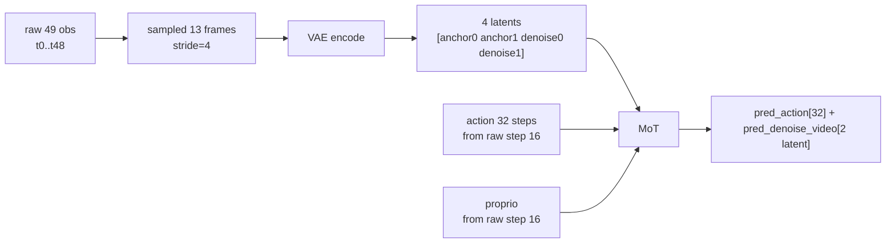

# Multi-Anchor Plan 2: LIBERO 2 anchor + 2 denoise

## 目标

- `num_anchor_frames=2, num_denoise_latent_frames=2` → `num_frames=49, action_horizon=32, sampled_video=13, latent=4`
- baseline `num_anchor_frames=1, num_denoise_latent_frames=2` → `num_frames=33, action_horizon=32`（严格等价旧行为）
- 与在库的 [plan_cc_codex_v2.1.md](mawam_dev/plans_and_actions/multi_anchor/plan_cc_codex_v2.1.md) / [plan_codex_v2.3.md](mawam_dev/plans_and_actions/multi_anchor/plan_codex_v2.3.md) 分析对齐。

## 关键时间语义（一次敲定，下面所有改动都围绕它）

- **anchor 段**：`num_anchor_frames` 个 latent，覆盖最近 `4*(N-1)+1` 个 sampled frames（raw `4*4*(N-1)+1` 步）。
- **denoise 段**：`num_denoise_latent_frames` 个 latent，覆盖未来 `4*M` 个 sampled frames（raw `16*M` 步）。
- **action 段**：长度 `action_horizon = action_video_freq_ratio * vae_temporal_downsample_factor * M`，**从最后一个 anchor 对应的 raw step 开始**。
- anchor 最后一个 raw step 位置 = `vae_temporal_downsample_factor * (N-1) * action_video_freq_ratio = 16*(N-1)`。

## 核心改动

### 1. 新增 resolver
[src/fastwam/utils/config_resolvers.py](src/fastwam/utils/config_resolvers.py)（现有 71 行）新增并注册：

```python
def latent_window_to_num_frames(num_anchor_frames, num_denoise_latent_frames,
                                action_video_freq_ratio, vae_temporal_downsample_factor):
    return 1 + int(action_video_freq_ratio) * int(vae_temporal_downsample_factor) \
           * (int(num_anchor_frames) + int(num_denoise_latent_frames) - 1)

def latent_window_to_action_horizon(num_denoise_latent_frames,
                                    action_video_freq_ratio, vae_temporal_downsample_factor):
    return int(action_video_freq_ratio) * int(vae_temporal_downsample_factor) \
           * int(num_denoise_latent_frames)
```

在 `register_default_resolvers()` 末尾注册：`_register("latent_window_to_num_frames", ...)`、`_register("latent_window_to_action_horizon", ...)`。

### 2. 模型配置新增语义参数

- [configs/model/fastwam.yaml](configs/model/fastwam.yaml) 第 33 行附近、[configs/model/fastwam_joint.yaml](configs/model/fastwam_joint.yaml)、[configs/model/fastwam_idm.yaml](configs/model/fastwam_idm.yaml)
- 在现有 `num_anchor_frames: 1` 下方添加 `num_denoise_latent_frames: 2`（仅配置期使用，不作为模型构造参数传入）。

### 3. 数据配置用 resolver 推导

- [configs/data/libero_2cam.yaml](configs/data/libero_2cam.yaml) 第 34 行：把 `num_frames: 33` 改为
  `num_frames: ${latent_window_to_num_frames:${model.num_anchor_frames},${model.num_denoise_latent_frames},${data.train.action_video_freq_ratio},4}`
- 同文件新增 `action_horizon: ${latent_window_to_action_horizon:${model.num_denoise_latent_frames},${data.train.action_video_freq_ratio},4}`
- `processor` 段新增 `num_action_steps: ${data.train.action_horizon}`（替代原 `num_obs_steps - 1` 的隐含假设）。
- [configs/data/robotwin.yaml](configs/data/robotwin.yaml) 同步改造，保持单锚点下 `num_frames` 不变。

### 4. 数据集：解耦 obs / action 长度

- [src/fastwam/datasets/lerobot/base_lerobot_dataset.py](src/fastwam/datasets/lerobot/base_lerobot_dataset.py) 第 40 行：删除 `assert action_size == obs_size - 1`，允许独立传入。
- [src/fastwam/datasets/lerobot/robot_video_dataset.py](src/fastwam/datasets/lerobot/robot_video_dataset.py) 第 30/49-50/56/59-62/200-203 行：
  - 构造签名新增 `action_horizon: int`、`num_anchor_frames: int`
  - 传给 `BaseLerobotDataset(..., obs_size=num_frames, action_size=action_horizon, ...)`
  - 新增整除校验：`(num_frames - 1) % action_video_freq_ratio == 0`、`action_horizon == action_video_freq_ratio * 4 * num_denoise_latent_frames` 或等价式
  - `__getitem__` 中 action / proprio 切片起点从 raw step `16 * (num_anchor_frames - 1)` 开始，长度 `action_horizon`（原第 202-203 行的 `[:-1]` 要改成右移切片）。

### 5. Processor 显式使用 `num_action_steps`

- [src/fastwam/datasets/lerobot/processors/fastwam_processor.py](src/fastwam/datasets/lerobot/processors/fastwam_processor.py) 与 [base_processor.py](src/fastwam/datasets/lerobot/processors/base_processor.py)：接受 `num_action_steps` 参数，`postprocess()` 中所有 `num_obs_steps - 1` 都替换为 `num_action_steps`。文档串里 `[action_horizon, ...]` 与之一致。

### 6. 模型对齐校验：只约束去噪段

统一口径：`denoise_sampled_transitions = (sampled_T - 1) - vae_temporal_downsample_factor * (num_anchor_frames - 1)`，要求 `action_horizon % denoise_sampled_transitions == 0`；latent 级用 `num_temporal_groups = num_latent_frames - num_anchor_frames`。

- [src/fastwam/models/wan22/fastwam.py](src/fastwam/models/wan22/fastwam.py) 第 396-399 行：替换整除检查。
- [src/fastwam/models/wan22/fastwam.py](src/fastwam/models/wan22/fastwam.py) 第 458-467 行：dataset 已经右移 proprio，这里 `proprio_idx = 0`（或等价直接取 `proprio[:, 0, :]`）；不再用 `vae_t_factor*(N-1)*freq_ratio` 反推。
- [src/fastwam/models/wan22/wan22.py](src/fastwam/models/wan22/wan22.py) 第 214、326 行：同上换成 denoise-段 sampled transitions 约束。
- [src/fastwam/models/wan22/wan_video_dit.py](src/fastwam/models/wan22/wan_video_dit.py) 第 442-444 行：外层整除检查用 `num_latent_frames - num_anchor_frames`，与 571 行 `num_temporal_groups = f - num_anchor_frames` 统一。
- [src/fastwam/models/wan22/fastwam_joint.py](src/fastwam/models/wan22/fastwam_joint.py) / [fastwam_idm.py](src/fastwam/models/wan22/fastwam_idm.py)：同步修正（若有对应检查）。

### 7. Trainer 评估走多锚点路径

[src/fastwam/trainer.py](src/fastwam/trainer.py) 第 414-426 行：

- `num_anchor_frames > 1` 时，把 `input_image` 改为 `video0[:, :4*(N-1)+1]` 对应帧的 list（每帧 `[3,H,W]`），走 `_encode_multi_image_latents_tensor` 路径。
- `proprio` 取 `sample["proprio"][0, 0]`（右移后序列第 0 步，与部署一致，无需再按 `num_frames` 反推）。

### 8. Eval / deploy 不再从 num_frames-1 推导

- [experiments/libero/eval_libero_single.py](experiments/libero/eval_libero_single.py) 第 281 行 `_infer_num_sampled_frames` 保留；`action_horizon` 入口优先读 `cfg.data.train.action_horizon`，找不到才退 `cfg.EVALUATION.action_horizon`，禁用 `num_frames-1` 兜底。
- [experiments/robotwin/fastwam_policy/deploy_policy.py](experiments/robotwin/fastwam_policy/deploy_policy.py) 第 380-383 行：按同一优先级改造。
- 既有的 `frame_history` deque 逻辑保持不变（已经按 `num_anchor_frames` 正确工作）。

## 数据流（2 anchor 情况）



## 验证

- 配置解析：
  - baseline 任务跑一次 dry-run：`num_frames==33, action_horizon==32`
  - 新变体：`num_frames==49, action_horizon==32, sampled_video==13, latent==4`
- 数据样本一次 shape 断言：`video.shape[2]==13, action.shape[0]==32, proprio.shape[0]==32`；动作首步对应 raw step 16。
- 训练一次 step：`input_latents.shape[2]==4, anchor_latents.shape[2]==2`，video loss 只覆盖后 2 个 latent（检查 `video_weight` mask 或 print）。
- baseline 等价性：把新配置下 `num_anchor_frames=1` 再跑一次，loss 曲线头 100 step 与旧代码一致。
- eval：LIBERO `num_anchor_frames=2` 评测能正常跑、frame deque 长度 17、实际送入的 `input_image` 是 5 帧列表。