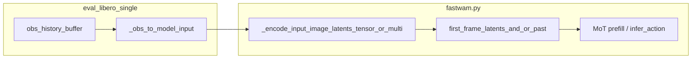

# 对 `run_libero_eval.sh` 的规划评价

该脚本职责清晰：**容器依赖（tmux/EGL）、路径（`FASTWAM_ROOT` / `LIBERO_ROOT`）、`PYTHONPATH`、非交互生成 `~/.libero/config.yaml`、Hydra 参数（`task` / `ckpt` / `EVALUATION.dataset_stats_path` / `MULTIRUN.*`）**。对「探索 FastWAM」而言，这是**评测入口与资源配置**，合理；**不包含**短历史、anchor 策略本身——那些必须在 Python 模型与数据管线里实现。

---

# 「短历史 anchor」应主要改哪里

语义：在仅当前帧作为 clean 首帧潜变量（[`first_frame_latents`](src/fastwam/models/wan22/fastwam.py)）之外，再引入**过去若干步观测**作为额外条件（anchor）。

**第一优先：模型 — [`src/fastwam/models/wan22/fastwam.py`](src/fastwam/models/wan22/fastwam.py)**

- `infer_action`（约 918 行起）里当前流程是：单张 `input_image` → `_encode_input_image_latents_tensor` → 作为首帧 clean latent，再 `prefill_video_cache` / 动作去噪。
- 训练前向里同样有 `first_frame_latents` 注入与 MoT 的 video 掩码（约 414 行附近 `first_frame_tokens`）。
- **短历史**需要在这里定义：多帧如何编码（时间维堆叠进 VAE、或每帧单独编码再融合、或拼到 spatial 维等）、如何与现有「仅首帧可见」的 attention 掩码对齐。这是架构决策的核心落点。

相关变体若用 joint / IDM 推理，逻辑在 [`fastwam_joint.py`](src/fastwam/models/wan22/fastwam_joint.py)、[`fastwam_idm.py`](src/fastwam/models/wan22/fastwam_idm.py) 的 `infer_action` / `infer_joint`，但主线仍是 **FastWAM 基类** 的条件构造方式。

**第二：LIBERO 评测闭环 — [`experiments/libero/eval_libero_single.py`](experiments/libero/eval_libero_single.py)**

- `_obs_to_model_input` / `_predict_action_chunk`（约 360 行起）目前每个 replan 步只用**当前** `obs` 调 `model.infer_action(**infer_kwargs)`。
- 需在 episode 循环里**维护短历史 buffer**，并在你扩展的 API 下把历史观测传入（与 [`run_single_episode`](experiments/libero/eval_libero_single.py) 中 `while` 循环衔接）。

**若要做训练一致（不仅是推理 hack）— [`src/fastwam/datasets/lerobot/base_lerobot_dataset.py`](src/fastwam/datasets/lerobot/base_lerobot_dataset.py)**

- 已有 `past_obs_size` / `delta_timestamps` 雏形，但 **`assert past_obs_size == 0`**（约 38–39 行）表明**当前训练管线未启用过去观测**。
- 启用短历史训练需：去掉该限制、保证 `lerobot` 取帧与 `FastWAMProcessor` 输出与模型输入一致。

---

# 简要数据流（便于对齐改动）

---

# 结论

| 层面 | 文件 | 作用 |
|------|------|------|
| **必改（定义 anchor）** | `src/fastwam/models/wan22/fastwam.py` | 多帧条件如何进入 VAE/MoT |
| **评测接线** | `experiments/libero/eval_libero_single.py` | 历史观测缓存与 API |
| **训练对齐（可选）** | `src/fastwam/datasets/lerobot/base_lerobot_dataset.py` | `past_obs_size` 与样本构造 |

[`run_libero_eval.sh`](experiments/libero/run_libero_eval.sh) 通常**只需在你加 Hydra 新键时**追加 override，不是「短历史」的主战场。
