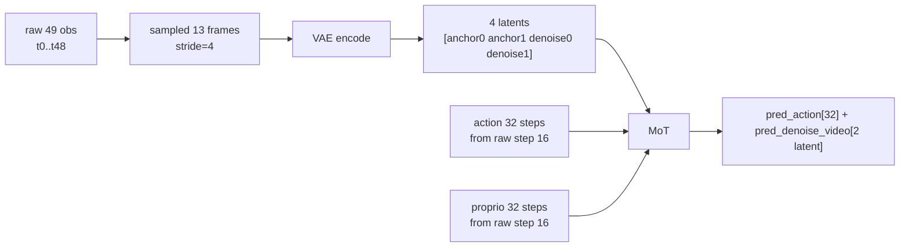

# Multi-Anchor Plan 2: LIBERO 2 anchor + 2 denoise

## 目标

- `num_anchor_frames=2, num_denoise_latent_frames=2` → `num_frames=49, action_horizon=32, sampled_video=13, latent=4`
- baseline `num_anchor_frames=1, num_denoise_latent_frames=2` → `num_frames=33, action_horizon=32`（严格等价旧行为）
- 与在库的 [plan_cc_codex_v2.1.md](mawam_dev/plans_and_actions/multi_anchor/plan_cc_codex_v2.1.md) / [plan_codex_v2.3.md](mawam_dev/plans_and_actions/multi_anchor/plan_codex_v2.3.md) 分析对齐。

## 关键时间语义

- **anchor 段**：`num_anchor_frames` 个 latent，覆盖最近 `4*(N-1)+1` 个 sampled frames。
- **denoise 段**：`num_denoise_latent_frames` 个 latent，覆盖未来 `4*M` 个 sampled frames。
- **action 段**：长度 `action_horizon = action_video_freq_ratio * vae_temporal_downsample_factor * M`，从最后一个 anchor 对应的 raw step 开始。
- anchor 最后一个 raw step = `vae_temporal_downsample_factor * (N-1) * action_video_freq_ratio = 16*(N-1)`。
- **本次不覆盖**：纯视频 `Wan22Core`（`create_wan22_model` 工厂路径）不承载 multi-anchor 语义，`wan22.py` 留作后续工作。

## 核心改动

### 1. 新增 resolver

[src/fastwam/utils/config_resolvers.py](src/fastwam/utils/config_resolvers.py) 新增并注册：

```python
def latent_window_to_num_frames(num_anchor_frames, num_denoise_latent_frames,
                                action_video_freq_ratio, vae_temporal_downsample_factor):
    return 1 + int(action_video_freq_ratio) * int(vae_temporal_downsample_factor) * (
        int(num_anchor_frames) + int(num_denoise_latent_frames) - 1
    )

def latent_window_to_action_horizon(num_denoise_latent_frames,
                                    action_video_freq_ratio, vae_temporal_downsample_factor):
    return int(action_video_freq_ratio) * int(vae_temporal_downsample_factor) * int(num_denoise_latent_frames)
```

在 `register_default_resolvers()` 注册：

- `latent_window_to_num_frames`
- `latent_window_to_action_horizon`

### 2. 配置归属调整

- `num_denoise_latent_frames` **不**放到 `configs/model/fastwam.yaml` / `fastwam_joint.yaml` / `fastwam_idm.yaml`
- 原因：`runtime.create_fastwam*` 工厂签名（[src/fastwam/runtime.py](src/fastwam/runtime.py) 第 91-109 行）没有该字段，Hydra `instantiate(cfg.model, ...)` 会因未知 kwarg 报错
- `num_denoise_latent_frames` 放到 `configs/data/libero_2cam.yaml` / `configs/data/robotwin.yaml` 的 `train` 下
- `val` 段若存在，其所有派生项（`num_frames` / `action_horizon` / `num_action_steps` / `num_anchor_frames`）统一引用 train：`${data.train.xxx}`，**避免双份独立源**导致漂移
- 当前 LIBERO `val_set_proportion=0.0` 无 val 段，无需改动；RobotWin 若有 val 需同步

### 3. 数据配置用 resolver 推导

- `configs/data/libero_2cam.yaml`（`data.train` 段下显式增改以下字段，均**必填**；缺一项会触发 OmegaConf 解析失败）
  - 新增 `num_denoise_latent_frames: 2`（resolver 的必需输入源）
  - 新增 `num_anchor_frames: ${model.num_anchor_frames}`（dataset 构造用；同时作为 data 段内的本地代理）
  - `num_frames: ${latent_window_to_num_frames:${data.train.num_anchor_frames},${data.train.num_denoise_latent_frames},${data.train.action_video_freq_ratio},4}`
  - 新增 `action_horizon: ${latent_window_to_action_horizon:${data.train.num_denoise_latent_frames},${data.train.action_video_freq_ratio},4}`
  - `processor` 段新增 `num_action_steps: ${data.train.action_horizon}`
  - **resolver 入参统一走 `${data.train.*}` 而不是跨层 `${model.num_anchor_frames}`**：保持 `data.train` 自洽（所有派生项只读 `data.train` 的字段），仅在"源头"一处 `num_anchor_frames: ${model.num_anchor_frames}` 做跨层跳转；这样 `data.train` 独立解析的 smoke test 与 Hydra `instantiate(cfg.data.train, ...)` 的行为都只依赖 data 段内部
- `configs/data/robotwin.yaml`
  - 显式新增 `num_denoise_latent_frames` 与 `num_anchor_frames`
  - 用 resolver 推导 `num_frames` 与 `action_horizon`
  - `processor` / `val.processor` 同步加 `num_action_steps`
  - `val` 段的 `num_anchor_frames` / `num_denoise_latent_frames` / `num_frames` / `action_horizon` / `action_video_freq_ratio` 统一 `${data.train.xxx}`，`val.processor.num_obs_steps` / `num_action_steps` 指向 `${data.val.num_frames}` / `${data.val.action_horizon}`

### 4. BaseLerobotDataset 支持 action offset

- [src/fastwam/datasets/lerobot/base_lerobot_dataset.py](src/fastwam/datasets/lerobot/base_lerobot_dataset.py)
- 删除 `assert action_size == obs_size - 1`（第 40 行）
- 构造参数新增 `action_start_offset: int = 0`
- action 的 `delta_timestamps` 改为从 `action_start_offset` 开始构造：
  `[(t * global_sample_stride) / fps for t in range(action_start_offset, action_start_offset + action_size)]`
- **state 的 delta_timestamps 不动**：state 仍然按 `obs_size` 全长采样（和 image 对齐），proprio 的右移切片放到 `RobotVideoDataset._get()` 里做
- 原因：这样 `state_is_pad` 语义单一（永远和 image_is_pad 同长），避免 `BaseLerobotDataset` 产出两种 state 长度
- 原因：multi-anchor 需要直接从 LeRobot 取 raw step [16..47] 这段 action，只在 `RobotVideoDataset` 后处理无法实现（LeRobot 的 `delta_timestamps` 决定了底层采样窗口）

### 5. RobotVideoDataset 解耦 obs / action 长度并对齐 pad mask

- [src/fastwam/datasets/lerobot/robot_video_dataset.py](src/fastwam/datasets/lerobot/robot_video_dataset.py)
- 构造签名新增：
  - `action_horizon: Optional[int] = None`
  - `num_anchor_frames: int = 1`
  - `num_denoise_latent_frames: Optional[int] = None`（显式用户声明，用作交叉校验；不为 None 时必须等于 `num_latent_frames - num_anchor_frames`）
- 计算：
  - `action_start_offset = 4 * action_video_freq_ratio * (num_anchor_frames - 1)`
- 传给 `BaseLerobotDataset(...)`：
  - `obs_size=num_frames`
  - `action_size=action_horizon`
  - `action_start_offset=action_start_offset`
- 保留并强化一致性校验（此处为 multi-anchor 硬约束的唯一真源；resolver 层只管推导，dataset 层负责拒绝非法组合）：
  - `(num_frames - 1) % action_video_freq_ratio == 0`
  - `sampled_T = (num_frames - 1) // action_video_freq_ratio + 1`
  - `(sampled_T - 1) % 4 == 0`
  - `num_latent_frames = 1 + (sampled_T - 1) // 4`
  - `num_latent_frames > num_anchor_frames`
  - `action_horizon == action_video_freq_ratio * 4 * (num_latent_frames - num_anchor_frames)`
  - `num_denoise_latent_frames`（若传入）`== num_latent_frames - num_anchor_frames`
- `_get()` 中（当前第 202-203 行位置）：
  - `action` 直接使用 BaseLerobotDataset 已 offset 后的 `sample["action"]`（长度 `action_horizon`）
  - `proprio = sample["proprio"][action_start_offset:action_start_offset + action_horizon, :]`（从完整 49 步 state 里切出 32 步）
  - `proprio_is_pad = sample["proprio_is_pad"][action_start_offset:action_start_offset + action_horizon]`
    - 注意：`_get()` 拿到的 sample 是 `processor.preprocess()` 之后的结果，此时已由 [fastwam_processor.py:274](src/fastwam/datasets/lerobot/processors/fastwam_processor.py) / [base_processor.py:233](src/fastwam/datasets/lerobot/processors/base_processor.py) 把 `data["state_is_pad"]` 改名写入 `sample["proprio_is_pad"]`，原 key `state_is_pad` 已不存在
  - `action_is_pad` 长度已由 BaseLerobot 保证为 `action_horizon`，透传
  - `image_is_pad` 保持完整 `num_frames` 长度，再按 `video_sample_indices` 下采样（现第 151 行逻辑不变）
- `skip_padding_as_possible` 重采样判定也要同步改到最终实际喂给模型的窗口语义：
  - 当前 [robot_video_dataset.py:124-133](src/fastwam/datasets/lerobot/robot_video_dataset.py) 在 `_get()` 前半段直接检查 `sample["action_is_pad"]` / `sample["image_is_pad"]` / `sample["proprio_is_pad"]`
  - `proprio_is_pad` 判定必须基于右移后的 32-step 窗口：`sample["proprio_is_pad"][action_start_offset:action_start_offset + action_horizon].any()`
  - `image_is_pad` 判定必须基于 `video_sample_indices` 子采样后的窗口：`sample["image_is_pad"][self.video_sample_indices].any()`；否则非采样位置（raw 1-3, 5-7…）的 pad 会造成假阳性重采样
  - `action_is_pad` 不用改：dataset 已经返回右移后的 32 步，直接 `any()` 即可
  - 否则 `skip_padding_as_possible=true` 时，重采样逻辑与最终实际喂给模型的 window 不一致
- 校验断言：`action.shape[0] == action_horizon and proprio.shape[0] == action_horizon`

### 6. Processor 显式使用 `num_action_steps`

- [src/fastwam/datasets/lerobot/processors/base_processor.py](src/fastwam/datasets/lerobot/processors/base_processor.py)
- [src/fastwam/datasets/lerobot/processors/fastwam_processor.py](src/fastwam/datasets/lerobot/processors/fastwam_processor.py)
- 构造参数新增 `num_action_steps: Optional[int] = None`
- 兼容旧配置：`num_action_steps is None` 时回退为 `num_obs_steps - 1`
- 新配置必须显式传 `num_action_steps`
- 长度一致性断言**不能**放在 processor `__init__`（该阶段拿不到样本张量）
- 防错分层（从上游到下游）：
  1. `RobotVideoDataset.__init__`：`action_horizon == action_video_freq_ratio * 4 * (num_latent_frames - num_anchor_frames)`（静态唯一真源）
  2. `RobotVideoDataset._get()`：`assert action.shape[0] == self.action_horizon and proprio.shape[0] == self.action_horizon`（每个样本运行期校验）
  3. `BaseProcessor.preprocess`：保留 `assert sample["action"].shape[0] == self.num_action_steps`，仅当子类没有覆写 `preprocess()` 时生效
- `FastWAMProcessor` 自身覆写了 `preprocess()`，**没有**挂这条 assert；multi-anchor 的一致性由上面 (1)(2) 已经兜底——plan 的意图是"样本张量一出现就能被拒"，dataset 层已经做到了，不在 processor 层重复校验
- 如果未来 `FastWAMProcessor.preprocess` 里出现更复杂的路径（例如开 `skip_padding_as_possible` 后重采样链路），再在 processor 层补同样的 assert 作为第二保险

**关于 `postprocess()` 里 `start_obs_step = num_obs_steps - 1`（[fastwam_processor.py:302-303](src/fastwam/datasets/lerobot/processors/fastwam_processor.py) / [base_processor.py:261-262](src/fastwam/datasets/lerobot/processors/base_processor.py)）**：

- 该变量是 `data["action"]` 的**切片起点**（`x[:, start_obs_step:, :]`），不是切片长度
- `processor.postprocess()` 在当前仓库无调用方（eval/deploy 各自实现 `_denormalize_action`），属于死代码
- 不要盲目把 `num_obs_steps - 1` 替换为 `num_action_steps`：新配置下 `data["action"]` shape `[B, 32, D]`，`[:, 32:, :]` 会产出空 tensor
- 本次处理策略：**保持 `postprocess()` 原逻辑不动**，只在注释里标注「未覆盖多锚点语义，调用前需重审起点」；若将来启用该路径，应把 `start_obs_step` 设为 `0`（dataset 已右移 action）

### 7. 模型对齐校验只约束去噪段

统一口径：

- `denoise_sampled_transitions = (sampled_T - 1) - vae_temporal_downsample_factor * (num_anchor_frames - 1)`
- 要求 `action_horizon % denoise_sampled_transitions == 0`
- latent 级保持 `num_temporal_groups = num_latent_frames - num_anchor_frames`

修改范围：

- [src/fastwam/models/wan22/fastwam.py](src/fastwam/models/wan22/fastwam.py)
  - 第 392-399 行训练输入整除检查改成只看去噪段
  - **删除** 第 454-467 行整段 `freq_ratio = action_horizon // (num_video_frames - 1)` 的 proprio 反推逻辑（新方案下 `32 // 12` 非整除，旧分支语义已废）
  - 新逻辑：dataset 已把 proprio 右移，这里直接 `proprio = proprio[:, 0, :]`
  - `infer()` 签名（当前 [fastwam.py:1217](src/fastwam/models/wan22/fastwam.py) `input_image: torch.Tensor`）改为 `input_image: Union[torch.Tensor, list[torch.Tensor]]`，与内部透传的 `infer_joint()` / `infer_action()` 的多锚点输入约定一致；trainer.evaluate 在 multi-anchor 下会直接传 list 进 `infer()`
- [src/fastwam/models/wan22/wan_video_dit.py](src/fastwam/models/wan22/wan_video_dit.py)
  - 第 442-444 行外层校验与内部 `num_temporal_groups = f - num_anchor_frames`（第 571 行）统一
- [src/fastwam/models/wan22/fastwam_joint.py](src/fastwam/models/wan22/fastwam_joint.py)
- [src/fastwam/models/wan22/fastwam_idm.py](src/fastwam/models/wan22/fastwam_idm.py)
  - 同步修正对应检查
- 不修改 [src/fastwam/models/wan22/wan22.py](src/fastwam/models/wan22/wan22.py)
  - 原因：`Wan22Core` 不在 `create_fastwam*` 链路上，不承载 multi-anchor 语义；如未来要开启纯视频 multi-anchor 再补

### 8. Trainer 评估走多锚点路径

- [src/fastwam/trainer.py](src/fastwam/trainer.py) 第 414-426 行
- `num_anchor_frames > 1` 时：
  - `input_image` 改为 `[video0[:, i].unsqueeze(0) for i in range(4*(N-1)+1)]`，走 `_encode_multi_image_latents_tensor` 路径
- `proprio` 继续取 `sample["proprio"][0, 0]`（dataset 已右移，第 0 步即 raw `16*(N-1)`，与训练 `proprio[:, 0, :]` 对齐）
- `_to_batched_eval_sample` 旧有的 `action.shape[1] % (num_video_frames - 1) != 0` 外层整除检查**移除**：multi-anchor 下 `action_horizon=32, num_video_frames=13`，`32 % 12 ≠ 0`，旧检查会直接拒掉合法样本；整除性交给下游 `FastWAM.build_inputs`（按 `denoise_sampled_transitions = (sampled_T - 1) - 4·(N−1)` 校验）与 `WanVideoDiT.pre_dit`（按 `num_temporal_groups = f − N` 校验）统一兜底
- `evaluate()` 调 `model.infer(...)` 时显式传 `action_horizon=sample['action_horizon']`（其值从 `sample["action"].shape[1]` 自动派生），与新 infer 签名一致

### 9. Eval / deploy 的 `action_horizon` 优先级

- [experiments/libero/eval_libero_single.py](experiments/libero/eval_libero_single.py)
- [experiments/robotwin/fastwam_policy/deploy_policy.py](experiments/robotwin/fastwam_policy/deploy_policy.py)

读取优先级固定为：

1. 显式 CLI 参数
2. `cfg.EVALUATION.action_horizon`
3. `cfg.data.train.action_horizon`
4. 仅兼容旧配置时，最后才退回 `cfg.data.train.num_frames - 1`

- 保留 `EVALUATION` 优先于 `data.train` 以兼容老脚本
- **注意**：对新 multi-anchor task，若老 `cfg.EVALUATION.action_horizon` 被显式设成 `num_frames - 1`（48），会覆盖掉正确值 32；迁移 task 时要清理该字段

### 10. `frame_history` 逻辑保持不变

- [experiments/libero/eval_libero_single.py](experiments/libero/eval_libero_single.py) 现有 `frame_history` / `deque(maxlen=...)` 逻辑保留
- [experiments/robotwin/fastwam_policy/deploy_policy.py](experiments/robotwin/fastwam_policy/deploy_policy.py) 同理
- 只要 `num_anchor_frames` 正确，现有 raw-frame buffer 再按 `action_video_freq_ratio` 子采样的方案即对
- `eval_libero_single.py` 里的 `_get_num_video_frames(cfg)` 推导不只影响 GT 视频可视化
- 当前非 `visualize_future_video` 路径下，若 `model.infer_action` 签名包含 `num_video_frames`，eval 也会把该值传入 `infer_action`
- 因此 multi-anchor 迁移后，这里的 `num_frames -> num_video_frames` 推导必须保持正确；不能把它视为纯可视化逻辑

### 11. 运行期诊断与兼容性保护（v2.4.1 补强）

为了让"参数 / 数据 / 权重"三方不匹配时能被立刻发现而不是在训练/评估里静默跑错，补了 5 处轻量守门：

- **FastWAMProcessor.preprocess 加防御性 assert**（[fastwam_processor.py:275](src/fastwam/datasets/lerobot/processors/fastwam_processor.py)）  
  `sample["action"].shape[0] == self.num_action_steps`；dataset 层本已兜底（`RobotVideoDataset.__init__` + `_get()`），这里作为第二保险，任何跳过 dataset 直接喂给 processor 的路径也能被拦
- **FastWAMProcessor.postprocess 死代码警示**（[fastwam_processor.py:304](src/fastwam/datasets/lerobot/processors/fastwam_processor.py)）  
  与 BaseProcessor 对齐：当前无调用方、若未来启用应把 `start_obs_step` 改为 `0`（dataset 已右移 action）
- **Eval / Deploy：`EVALUATION.action_horizon` vs `data.train.action_horizon` 不一致 WARNING**  
  [eval_libero_single.py:819](experiments/libero/eval_libero_single.py) / [deploy_policy.py:382](experiments/robotwin/fastwam_policy/deploy_policy.py)  
  旧任务常有 `EVALUATION.action_horizon: 48` 残留，在新 multi-anchor 下会静默覆盖正确的 32；现在任一路径走到回退/覆盖分支都会打日志。建议新任务 `EVALUATION.action_horizon: null`
- **RobotVideoDataset.__init__ episode 长度统计**（[robot_video_dataset.py:93](src/fastwam/datasets/lerobot/robot_video_dataset.py)）  
  主进程一次性打印 `min/mean/max` episode length 与 `num_frames + action_start_offset` 比较；过短 episode 直接 WARN，提醒用户考虑 `skip_padding_as_possible=true` 或重估数据
- **FastWAM.save/load_checkpoint 持久化 `num_anchor_frames`**（[fastwam.py:1250](src/fastwam/models/wan22/fastwam.py)）  
  save 时写入 `payload["num_anchor_frames"] = self.num_anchor_frames`；load 时若 ckpt 未含该字段且 runtime N>1，或含该字段且与 runtime N 不一致，都打 WARNING 明示"anchor/denoise latent 对齐被破坏，必须重训或改回原 N"。这是对跨 N 热插拔的最终防线

## 数据流（2 anchor 情况）



## 副作用与注意事项

### A. LeRobot episode 尾部 pad 比例上升

- `action_start_offset=16` 让 action `delta_timestamps=[16..47]/fps`，episode 最后 47 步 rolling sample 都可能触发 action pad（旧方案只有最后 31 步）
- `skip_padding_as_possible=false`（LIBERO 当前值）时训练会吃到更多 pad 样本；开启 skip 则有效样本数下降
- 迁移前检查 LIBERO episode 长度统计；必要时调整 `skip_padding_as_possible` 或重估数据规模

### B. 归一化统计依赖新的 `action_size`

- `BaseLerobotDataset._get_episode_data`（第 156-167 行）用 `sliding_window_with_replication(a, self.action_size)` 计算 action 的 min/max/mean/std
- **注意 normalizer 的滑窗不带 `action_start_offset`**：统计窗口是 `[t, t+action_size)`，而 N≥2 下训练/推理实际窗口是 `[t+16(N-1), t+16(N-1)+action_size)`
- 改 N 时 `action_size` 不变（仍为 `K_vf · D_vae · M`），在 episode-level action 分布近似 stationary 的前提下，baseline 的 `pretrained_norm_stats` 可直接复用；**严格意义上是"分布近似一致"而非"数值完全一致"**，若数据集 action 分布随时间有显著漂移（例如抓取末期与初期动作幅度差异大），应重算并比较差异
- 改 `num_denoise_latent_frames` / `action_video_freq_ratio` 使 `action_size` 变化时，normalizer 必须重算（`pretrained_norm_stats` 需作废）

### C. Processor `num_action_steps=None` 回退仅用于旧配置

- 新配置必须显式传 `num_action_steps`；回退 `num_obs_steps - 1` 仅为了保持未迁移任务的构造签名兼容
- 运行期长度校验分布在 dataset 层：`RobotVideoDataset.__init__`（静态）+ `RobotVideoDataset._get()`（每样本），`BaseProcessor.preprocess` 另有一层 assert（`FastWAMProcessor` 子类覆写 `preprocess()`，未挂该 assert，由 dataset 层兜底）
- 全部放在拿得到样本张量的阶段，不放在 `__init__`（初始化阶段没有样本）
- 切勿依赖隐式回退，避免静默错位

### D. 切窗 pad 检查会轻微放宽 baseline 重采样条件

- `num_anchor_frames=1` 时：
  - 旧：`proprio_is_pad[0:33].any()` / `image_is_pad[0:33].any()`（对全 obs 窗口判定）
  - 新：`proprio_is_pad[0:32].any()` / `image_is_pad[video_sample_indices].any()`（对实际使用窗口判定）
- 若样本只在最后 1 步 proprio 有 pad、或 pad 仅出现在非采样 image 位置，旧代码会重采样、新代码不会
- baseline 严格等价性从「样本 id 逐一致」弱化为「分布一致」；有效数据量轻微上升（<1%），训练曲线短期内应基本重合

## 迁移 / 上线 runbook

### 1. 配置解析 smoke test（必跑）

```bash
python -c "
from hydra import compose, initialize
from fastwam.utils.config_resolvers import register_default_resolvers
register_default_resolvers()
with initialize(config_path='configs', version_base=None):
    for task in ['libero_uncond_2cam224_1e-4','robotwin_uncond_3cam_384_1e-4']:
        for n in (1, 2):
            cfg = compose(config_name='train', overrides=[f'task={task}', f'model.num_anchor_frames={n}'])
            print(task, 'N=', n,
                  'num_frames=', cfg.data.train.num_frames,
                  'action_horizon=', cfg.data.train.action_horizon,
                  'num_action_steps=', cfg.data.train.processor.num_action_steps)
"
```

期望（与 [action_v2.4.md](action_v2.4.md) 一致）：

```
libero_uncond_2cam224_1e-4  N= 1  num_frames= 33  action_horizon= 32  num_action_steps= 32
libero_uncond_2cam224_1e-4  N= 2  num_frames= 49  action_horizon= 32  num_action_steps= 32
robotwin_uncond_3cam_384_1e-4  N= 1  num_frames= 33  action_horizon= 32  num_action_steps= 32
robotwin_uncond_3cam_384_1e-4  N= 2  num_frames= 49  action_horizon= 32  num_action_steps= 32
```

### 2. 老任务 / 老 ckpt 迁移清单

| 项 | 旧值 / 状态 | 新任务应改成 | 触发信号 |
| --- | --- | --- | --- |
| `EVALUATION.action_horizon` | 常见 `48`（= `num_frames-1`） | `null`（由 `data.train.action_horizon` 推导） | eval/deploy 启动时 WARNING："overrides data.train.action_horizon" |
| `configs/data/*.yaml` 中显式 `num_frames`、`action_horizon` | 硬编码 33 / 32 | 用 `${latent_window_to_num_frames:...}` / `${latent_window_to_action_horizon:...}` resolver | 改 N 时不会自动更新 → 数据加载时 shape 不匹配 |
| `processor.num_action_steps` | 缺省 | `${data.train.action_horizon}` | processor 落回 `num_obs_steps - 1` 旧分支 |
| `pretrained_norm_stats` | baseline 32 步统计 | 改 N：可复用；改 M / K_vf：必须重算 | 见 §B |
| 老 ckpt（无 `num_anchor_frames` 字段） | 默认 N=1 语义 | 只能 N=1 运行；N>1 会 WARN 并产生错误预测 | `load_checkpoint` WARNING："Checkpoint has no num_anchor_frames metadata ... NOT supported" |

### 3. N>1 跨版本 ckpt 规则

- **允许**：N=1 ckpt + N=1 runtime（等价旧 baseline）、同 N 训练-评估闭环
- **禁止**（会 WARN 但不硬拒，因为有些下游可能故意做 probing）：
  - N=1 ckpt 加载进 N>1 runtime
  - N>1 ckpt 加载进 N=1 runtime
  - N=a ckpt 加载进 N=b runtime（a ≠ b）
- 原因：DiT 的 `build_video_to_video_mask` 与 `action_cross_attn mask` 的 `num_temporal_groups = f − N` 都随 N 变化；权重形状可以通过 `strict=False` 吃下，但 latent 物理语义已经错位
- 推荐工作流：新 N 要么从 Wan2.2 pretrained 重新 finetune，要么从"同 N"的 baseline ckpt 继续

### 4. 数据规模评估（新 N 会让尾部 pad 变多）

- 迁移前用 §11 的 episode 长度 diagnostic（`RobotVideoDataset.__init__` 启动日志）检查 `num_too_short` / `num_action_may_pad`
- LIBERO 典型 episode 长度 ~150 steps，N=2 的 `num_frames=49 + action_start_offset=16 = 65`，尾部浪费 65 / 150 ≈ 43%（旧 baseline 33 / 150 ≈ 22%）
- 若比例超过 1/3 建议开 `skip_padding_as_possible=true`（LIBERO 默认 false，可通过 `task=... data.train.skip_padding_as_possible=true` 覆盖）

## 验证

### A. 静态（配置 / 断言）

- 配置解析：
  - baseline：`num_frames==33, action_horizon==32`
  - multi-anchor：`num_frames==49, action_horizon==32, sampled_video==13, latent==4`
- `RobotVideoDataset.__init__` 启动日志包含：
  - `[RobotVideoDataset/train] episodes=... | length min=... mean=... max=...`
  - 派生 `num_frames / action_start_offset / action_horizon / num_anchor_frames` 与配置一致

### B. 运行期（数据样本）

- `video.shape[1]==13`
- `action.shape[0]==32`
- `proprio.shape[0]==32`
- `action_is_pad.shape[0]==32`
- `proprio_is_pad.shape[0]==32`
- 动作首步对应 raw step 16
- `image_is_pad` 仍为 13（sampled）
- FastWAMProcessor.preprocess 的 action 长度 assert 在长度错配时直接 raise（第二保险）

### C. 训练一次 step

- `input_latents.shape[2]==4`
- `anchor_latents.shape[2]==2`
- video loss 只覆盖后 2 个 latent
- `proprio[:, 0, :]` 被 append 到 context，无 `num_video_frames` 反推路径
- `build_inputs` 按 `denoise_sampled_transitions = (sampled_T−1) − 4·(N−1) = 8` 做整除检查
- `pre_dit` 按 `num_temporal_groups = f − N = 2` 做 action cross-attn 分组

### D. baseline 回归（`num_anchor_frames=1`）

- `action_start_offset=0`，`action_size=obs_size-1=32`
- `image_is_pad` 判定从"全 33 步"改为"sampled 9 步"，样本 id 不再逐个一致但分布一致（见 §D）
- ckpt 读取/保存行为不变（N=1 weights 保存时会写 `num_anchor_frames=1`）

### E. eval

- LIBERO `num_anchor_frames=2` 正常跑通
- `frame_history` 原始长度为 17，实际送入 `input_image` 的是 5 帧 list
- `EVALUATION.action_horizon` 未显式设置时 eval 用 32
- 若显式设成 48，eval 启动时打 WARNING 并按 48 执行（兼容性保留）

### F. 兼容性

- 未显式配置 `num_action_steps` 的旧 processor 配置仍能初始化（回退分支）
- 旧单锚点任务不需要额外改 task 配置即可运行
- 旧 ckpt（无 `num_anchor_frames` 字段）载入 N>1 运行时会 WARN 明示"不支持"
